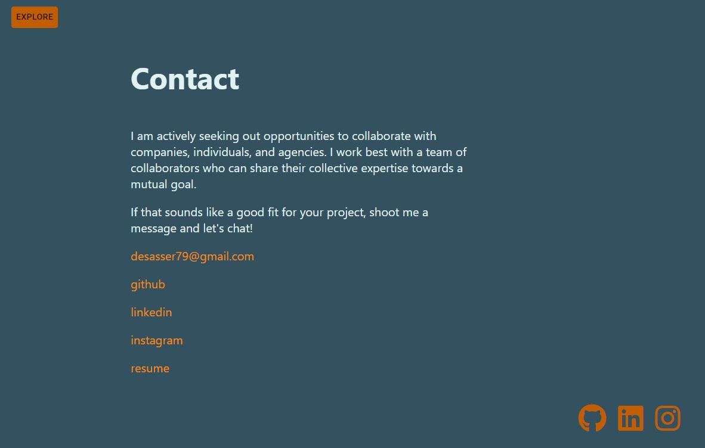

# Portfolio
## Completed by: 
### desasser

 

## Link: https://des-react-portfolio.herokuapp.com/
## Repo: https://github.com/desasser/react-portfolio

 
- - - - - - - - - - - - - - - - - - - - - - - - - - - - - - - - - - - - - - - - - - - - - - - - 

## Description: 
This is my personal portfolio built with React.

## Table of Contents: 
* [Installation](#installation)
* [Usage](#usage)
* [License](#license)
* [Contributing](#contributing)
* [Tests](#tests)
* [Questions](#questions)

## Screenshot
### Landing Page

 

### Projects Page

 

### Contact Page

## Installation: 
This project is online and does not require any installation to function.

## Usage: 
This is a single page app for my personal portfolio.

## License: 
This project is covered under the MIT license. 

## Contributing: 
No contributions necessary.

## Questions:
* https://github.com/desasser
* desasser79@gmail.com

You can reach me via email at the above address with any additional questions, comments, or concerns regarding this project.